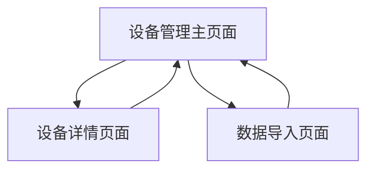

# 电力设备压板管理系统产品需求文档

## 1. Product Overview
电力设备压板管理系统是一个专业的电力设备管理平台，主要用于管理电力系统中的保护屏、压板设备等关键设备信息。
- 解决电力设备管理中的数据录入、查询、维护等问题，为电力运维人员提供高效的设备管理工具。
- 目标是提升电力设备管理效率，确保电力系统安全稳定运行。

## 2. Core Features

### 2.1 User Roles
| Role | Registration Method | Core Permissions |
|------|---------------------|------------------|
| 运维人员 | 系统管理员分配账号 | 可查看、新增、修改设备信息 |
| 系统管理员 | 超级管理员创建 | 拥有所有权限，包括用户管理、系统配置 |

### 2.2 Feature Module
我们的电力设备压板管理系统包含以下主要页面：
1. **设备管理主页面**：搜索筛选区域、数据表格展示、操作按钮组
2. **设备详情页面**：设备详细信息展示和编辑
3. **数据导入页面**：批量导入设备数据功能

### 2.3 Page Details
| Page Name | Module Name | Feature description |
|-----------|-------------|---------------------|
| 设备管理主页面 | 搜索筛选区域 | 提供保护屏、设备问题、压板名称搜索框，压板类型下拉选择，参与和重置按钮 |
| 设备管理主页面 | 功能操作区域 | 包含新增、修改、删除、导入、压板木箱配置等操作按钮 |
| 设备管理主页面 | 数据表格 | 显示序号、所属电站、保护屏、设备问题、压板名称、类型、压板木箱、压板动词等列，支持行选择和批量操作 |
| 设备详情页面 | 设备信息表单 | 展示和编辑设备的详细信息，包括所有字段的录入和修改 |
| 设备详情页面 | 操作按钮 | 保存、取消、删除等操作功能 |
| 数据导入页面 | 文件上传 | 支持Excel文件上传，批量导入设备数据 |
| 数据导入页面 | 数据预览 | 导入前数据预览和验证功能 |

## 3. Core Process
**运维人员操作流程：**
用户登录系统后，进入设备管理主页面，可以通过搜索筛选功能快速定位目标设备，查看设备列表信息。需要新增设备时，点击新增按钮进入设备详情页面录入信息。需要修改设备信息时，选择目标设备后点击修改按钮。需要批量导入数据时，进入数据导入页面上传Excel文件。

## 4. User Interface Design
### 4.1 Design Style
- 主色调：蓝绿色系（#4A90A4），辅助色：灰色（#F5F5F5）
- 按钮样式：圆角矩形按钮，主要按钮使用蓝绿色背景
- 字体：微软雅黑，标题14px，正文12px
- 布局风格：卡片式布局，顶部导航，左侧可扩展为菜单栏
- 图标风格：简洁线性图标，配合功能按钮使用

### 4.2 Page Design Overview
| Page Name | Module Name | UI Elements |
|-----------|-------------|-------------|
| 设备管理主页面 | 搜索筛选区域 | 白色背景卡片，输入框采用浅灰色边框，下拉选择框统一样式，按钮采用主色调 |
| 设备管理主页面 | 功能操作区域 | 浅蓝绿色背景条，按钮采用图标+文字组合，间距均匀排列 |
| 设备管理主页面 | 数据表格 | 白色背景，表头采用浅灰色背景，行间隔色彩区分，支持鼠标悬停高亮 |
| 设备详情页面 | 设备信息表单 | 表单采用两列布局，标签右对齐，输入框统一宽度和样式 |
| 数据导入页面 | 文件上传 | 拖拽上传区域，虚线边框，支持点击和拖拽两种方式 |

### 4.3 Responsiveness
系统采用桌面优先设计，支持1024px以上分辨率，考虑平板设备的适配，暂不考虑手机端适配。表格在小屏幕下支持横向滚动。