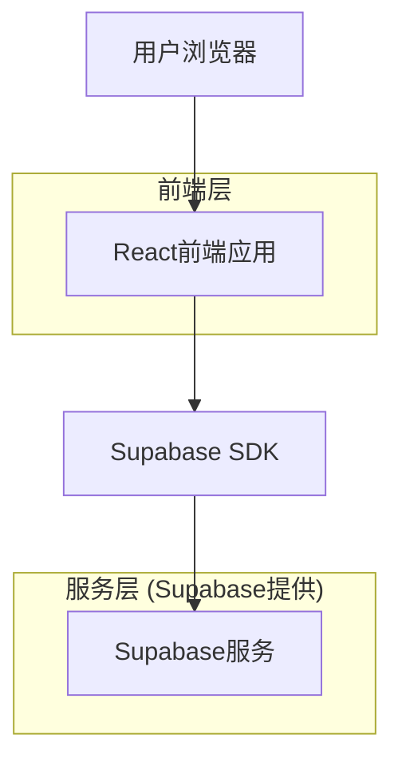
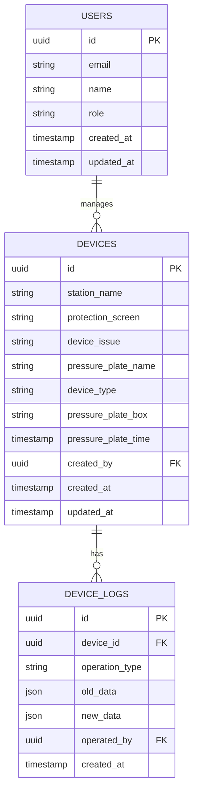

# 电力设备压板管理系统技术架构文档

## 1. Architecture design



## 2. Technology Description

* 前端: React\@18 + TypeScript + Ant Design\@5 + Vite

* 后端: Supabase (提供数据库、认证、存储服务)

* 数据库: Supabase PostgreSQL

## 3. Route definitions

| Route       | Purpose               |
| ----------- | --------------------- |
| /           | 设备管理主页面，显示设备列表和搜索筛选功能 |
| /device/:id | 设备详情页面，显示和编辑设备详细信息    |
| /device/new | 新增设备页面，录入新设备信息        |
| /import     | 数据导入页面，批量导入设备数据       |
| /login      | 登录页面，用户身份验证           |

## 4. API definitions

### 4.1 Core API

设备管理相关接口通过Supabase客户端SDK实现：

**获取设备列表**

```typescript
// 通过Supabase客户端查询
const { data, error } = await supabase
  .from('devices')
  .select('*')
  .order('created_at', { ascending: false })
```

**创建设备**

```typescript
// 通过Supabase客户端插入
const { data, error } = await supabase
  .from('devices')
  .insert([deviceData])
```

**更新设备**

```typescript
// 通过Supabase客户端更新
const { data, error } = await supabase
  .from('devices')
  .update(deviceData)
  .eq('id', deviceId)
```

**删除设备**

```typescript
// 通过Supabase客户端删除
const { data, error } = await supabase
  .from('devices')
  .delete()
  .eq('id', deviceId)
```

## 5. Data model

### 5.1 Data model definition



### 5.2 Data Definition Language

**用户表 (users)**

```sql
-- 创建用户表
CREATE TABLE users (
    id UUID PRIMARY KEY DEFAULT gen_random_uuid(),
    email VARCHAR(255) UNIQUE NOT NULL,
    name VARCHAR(100) NOT NULL,
    role VARCHAR(20) DEFAULT 'operator' CHECK (role IN ('operator', 'admin')),
    created_at TIMESTAMP WITH TIME ZONE DEFAULT NOW(),
    updated_at TIMESTAMP WITH TIME ZONE DEFAULT NOW()
);

-- 设置权限
GRANT SELECT ON users TO anon;
GRANT ALL PRIVILEGES ON users TO authenticated;
```

**设备表 (devices)**

```sql
-- 创建设备表
CREATE TABLE devices (
    id UUID PRIMARY KEY DEFAULT gen_random_uuid(),
    station_name VARCHAR(100) NOT NULL COMMENT '所属电站',
    protection_screen VARCHAR(100) NOT NULL COMMENT '保护屏',
    device_issue VARCHAR(200) COMMENT '设备问题',
    pressure_plate_name VARCHAR(100) NOT NULL COMMENT '压板名称',
    device_type VARCHAR(20) NOT NULL CHECK (device_type IN ('软', '硬')) COMMENT '类型',
    pressure_plate_box VARCHAR(100) COMMENT '压板木箱',
    pressure_plate_time TIMESTAMP WITH TIME ZONE COMMENT '压板动词',
    created_by UUID REFERENCES users(id),
    created_at TIMESTAMP WITH TIME ZONE DEFAULT NOW(),
    updated_at TIMESTAMP WITH TIME ZONE DEFAULT NOW()
);

-- 创建索引
CREATE INDEX idx_devices_station_name ON devices(station_name);
CREATE INDEX idx_devices_protection_screen ON devices(protection_screen);
CREATE INDEX idx_devices_device_type ON devices(device_type);
CREATE INDEX idx_devices_created_at ON devices(created_at DESC);

-- 设置权限
GRANT SELECT ON devices TO anon;
GRANT ALL PRIVILEGES ON devices TO authenticated;

-- 初始化数据
INSERT INTO devices (station_name, protection_screen, device_issue, pressure_plate_name, device_type, pressure_plate_box, pressure_plate_time) VALUES
('海宁电站', '红牌4W556G03分组电流差动保护屏', '红牌4W55开关问题', '重合闸出口LP压板', '软', 'XXXX', '2024-01-15 10:30:00'),
('海宁电站', '无闸柜', '红牌8P1问题', '红牌8P1开关保护合出L2LP压板', '硬', 'XXXX', '2024-01-15 11:45:00'),
('海宁电站', '2号主变保护装置', '4U高6G3开关问题', '保护跳CLP1压板', '软', 'XXXX', '2024-01-15 14:20:00'),
('海宁电站', '红牌4W556G03分组电流差动保护屏', '2号主变问题', '高后备保护312开关-2CLP1压板', '硬', 'XXXX', '2024-01-15 16:10:00'),
('海宁电站', '2号主变保护装置', '4U高6G3开关问题', '保护跳CLP1压板', '软', 'XXXX', '2024-01-15 17:30:00'),
('海宁电站', '无闸柜', '红牌8P1问题', '高后备保护312开关-2CLP1压板', '硬', 'XXXX', '2024-01-15 18:45:00');
```

**操作日志表 (device\_logs)**

```sql
-- 创建操作日志表
CREATE TABLE device_logs (
    id UUID PRIMARY KEY DEFAULT gen_random_uuid(),
    device_id UUID REFERENCES devices(id) ON DELETE CASCADE,
    operation_type VARCHAR(20) NOT NULL CHECK (operation_type IN ('create', 'update', 'delete')),
    old_data JSONB,
    new_data JSONB,
    operated_by UUID REFERENCES users(id),
    created_at TIMESTAMP WITH TIME ZONE DEFAULT NOW()
);

-- 创建索引
CREATE INDEX idx_device_logs_device_id ON device_logs(device_id);
CREATE INDEX idx_device_logs_created_at ON device_logs(created_at DESC);

-- 设置权限
GRANT SELECT ON device_logs TO anon;
GRANT ALL PRIVILEGES ON device_logs TO authenticated;
```

